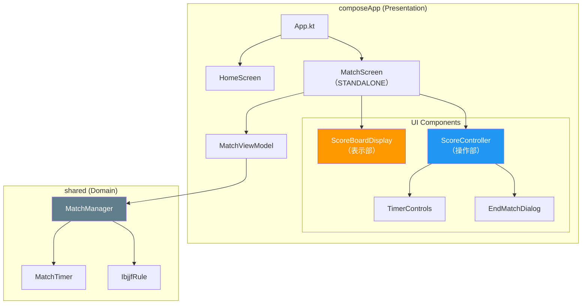

# KMPアプリのアーキテクチャとDIについての考察 (2026-07-18)

## 1. JiuJitsuScoreBoard KMP の現在のアーキテクチャ

現在のアーキテクチャは、「Google公式のAndroidアーキテクチャガイドライン」と「クリーンアーキテクチャ（軽量版）」を組み合わせた **MVVM + UDF（単方向データフロー）** を採用している。



### 3つのレイヤー
- **UIレイヤー (Presentation)**: `composeApp`
- **ドメインレイヤー (Domain)**: `shared`
- **データレイヤー (Data)**: 現時点ではインメモリのみだが、今後拡張予定。

### UDF（単方向データフロー）のイメージ
ユーザーの操作が下へ流れ、状態が上へ流れる構造。

```kotlin
// ドメインレイヤー (MatchManager.kt)
class MatchManager {
    // 状態のストリーム（川）
    private val _state = MutableStateFlow(MatchState())
    val state: StateFlow<MatchState> = _state.asStateFlow()

    // イベントを受け取って状態を更新
    fun addPoint() {
        _state.value = _state.value.copy(points = _state.value.points + 2)
    }
}

// UIレイヤー (MatchScreen.kt)
@Composable
fun MatchScreen(viewModel: MatchViewModel) {
    // 状態を購読して画面を自動更新
    val state by viewModel.state.collectAsState()
    
    Button(onClick = { viewModel.onAddPoint() }) {
        Text("Points: ${state.points}")
    }
}
```

---

## 2. アプリ内DBとデータレイヤー

### KMPでのDB技術選定（Room vs SQLDelight の判断基準）

**1. Room Multiplatform (コードファースト)**
Kotlinのコードにアノテーションを付けてSQLを生成させる。Android開発者にお馴染み。

```kotlin
// Roomのコード例
@Entity(tableName = "match_history")
data class MatchHistory(
    @PrimaryKey(autoGenerate = true) val id: Int = 0,
    val winnerName: String
)

@Dao
interface MatchHistoryDao {
    @Query("SELECT * FROM match_history")
    fun getAll(): Flow<List<MatchHistory>>
}
```

**2. SQLDelight (SQLファースト)**
`.sq` ファイルに生のSQLを書き、そこからKotlinコードを自動生成させる。KMPでの圧倒的な実績がある。

```sql
-- SQLDelightのコード例 (MatchHistory.sq)
CREATE TABLE match_history (
    id INTEGER PRIMARY KEY AUTOINCREMENT,
    winnerName TEXT NOT NULL
);

selectAll:
SELECT * FROM match_history;
```

### 補足：Realm からの移行との違い（SQLiteの互換性）
Room も SQLDelight も、裏側で動いているのは全く同じ **SQLite**（`.db` ファイル）である。
RealmのようなNoSQLからRoom（SQL）への移行は「地獄の移行作業」になるが、Room ⇔ SQLDelight 間の移行はデータベースファイルの引っ越しが不要なため、比較的低コストで乗り換え可能。

---

## 3. クリーンアーキテクチャとDI（依存性の注入）

### 現状のDI実装 (手動DI)
現在はライブラリを使わず、コンストラクタで依存を注入している。

```kotlin
// 手動DIの例
class MatchViewModel(
    private val rule: MatchRule = IbjjfRule() // デフォルト引数で注入
) : ViewModel() { ... }
```

### DIライブラリの導入について
初期フェーズは手動DIで十分だが、将来的に「別団体ルールの追加」などで依存関係が増えたタイミングでライブラリを導入すべき。
KMPでは **Koin がデファクトスタンダード**となっている（HiltはKMPでは動かせないため）。

```kotlin
// Koinを使ったDIの例
val appModule = module {
    // IbjjfRuleをシングルトンとして登録
    single<MatchRule> { IbjjfRule() }
    factory { MatchViewModel(get()) }
}

// 使う側
val viewModel: MatchViewModel by inject()
```

---

## 4. KMPにおけるHTTP通信

KMPの `commonMain` ではRetrofitは利用できないため、JetBrains公式の **Ktor Client** を利用する。エンジンを各OSで切り替えることができる。

```kotlin
// Ktor Clientのコード例
val client = HttpClient {
    install(ContentNegotiation) {
        json() // JSONパースを自動化
    }
}

// 実際の通信（suspend関数内）
suspend fun fetchTournamentInfo(): TournamentInfo {
    return client.get("https://api.example.com/tournament").body()
}
```

---

## 5. KMPにおける非同期処理とリアルタイム通信

FireStoreのようなリアクティブな仕組みや非同期処理は、KMPでは **Kotlin Coroutines / Flow** が標準。

### 単発の非同期処理 (Coroutines)
コールバックを使わず、上から下へ直感的に書ける。

```kotlin
// Coroutinesの例
viewModelScope.launch {
    // ネットワーク通信などの重い処理
    val data = fetchTournamentInfo() 
    updateUi(data) // 通信完了後に実行される
}
```

### リアルタイムな連続通信 (Flow)
時間経過とともに流れてくるデータのストリーム。本アプリのスコア管理 (`MatchManager` の `StateFlow`) にも使われている仕組み。

```kotlin
// Flowの例
fun observeTimer(): Flow<Int> = flow {
    var time = 0
    while (true) {
        emit(time) // 1秒ごとに時間を流す
        delay(1000)
        time++
    }
}

// 受け取る側
observeTimer().collect { currentTime ->
    println("現在の時間: $currentTime")
}
```

---

## 参考資料（一次情報）

本記事で解説した各技術・アーキテクチャの公式ドキュメント（一次情報）は以下の通りです。

- **アーキテクチャ**
  - [Google 公式 Android アプリアーキテクチャ ガイド](https://developer.android.com/topic/architecture?hl=ja)
- **データベース (Data Layer)**
  - [Room Multiplatform (Google 公式)](https://developer.android.com/kotlin/multiplatform/room?hl=ja)
  - [SQLDelight (Cash App 公式)](https://sqldelight.github.io/sqldelight/)
- **依存性の注入 (DI)**
  - [Koin 公式ドキュメント](https://insert-koin.io/)
  - [Dagger Hilt (Google 公式)](https://developer.android.com/training/dependency-injection/hilt-android?hl=ja)
- **HTTPクライアント**
  - [Ktor Client 公式ドキュメント](https://ktor.io/docs/client-create-new-application.html)
- **非同期処理・リアクティブプログラミング**
  - [Kotlin Coroutines 公式ガイド](https://kotlinlang.org/docs/coroutines-guide.html)
  - [Kotlin Flow 公式ガイド](https://kotlinlang.org/docs/flow.html)
