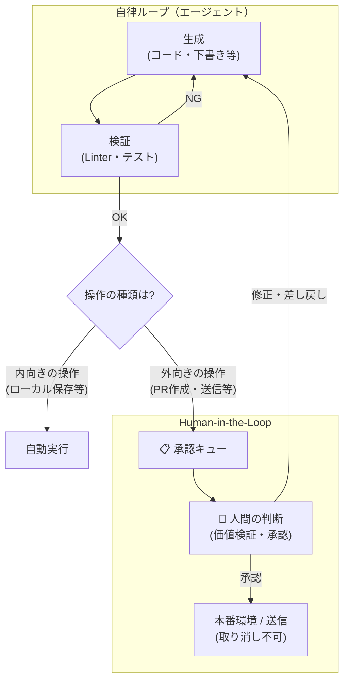
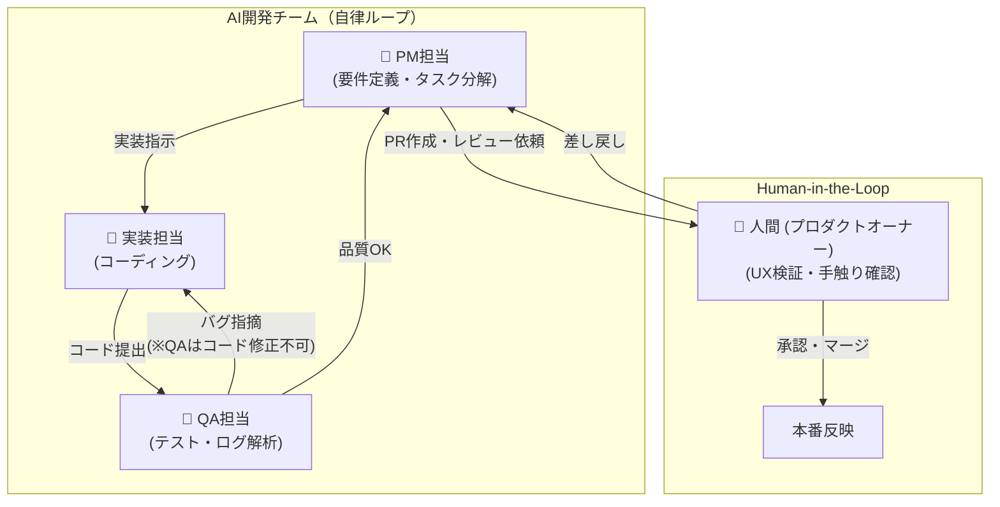

# AIエージェント開発手法の整理（ループエンジニアリング周辺）

AIエージェントを活用した開発パラダイムである「ハーネスエンジニアリング」「ループエンジニアリング」「構造化ループエンジニアリング」の違いと、それらを統合する概念について整理する。

## 1. 3つのエンジニアリング概念の違い
AIを単なるテキスト生成器から「自律的にタスクを完了させるエージェント」へと引き上げるためのアプローチは、設計する対象（抽象度の階層）によって以下のように分類できる。

| 概念 | 設計対象 | 主な役割・特徴 | 具体例 |
| --- | --- | --- | --- |
| ハーネスエンジニアリング | 実行環境（1階） | AIが安全かつ適切に仕事をするための「足場」や「制約」を作る。 | コンテキストの注入（.cursorrules等）、Linter、テスト環境の整備。 |
| ループエンジニアリング | 自律実行フロー（2階） | 用意された環境上で、目的達成まで「計画→実行→検証→修正」のサイクルを回す。 | コードを書く→テスト実行→エラーを読んで自己修正するプロセスの自動化。 |
| 構造化ループエンジニアリング | 組織構造（3階） | ループを単一エージェントではなく、仮想的な「開発組織」として分業・統制する。 | PM、実装、QA、UIデザイナーなどの役割（ペルソナ）を定義し、お互いにレビューし合う体制。 |

## 2. ループエンジニアリングの実践とパラダイムシフト
ループエンジニアリングを実プロジェクトに導入する上で、本質的なパラダイムシフトと具体的な運用手法を整理する。

* **パラダイムシフト**: 「エージェントにプロンプトを打つのではなく、打たせる側に回れ」。人間が都度指示を出すのではなく、AI自身が次のステップを考え、自身（または他のエージェント）にプロンプトを自律的に投げる仕組みを作ることが本質である。
* **状態の永続化**: STATE.md や LOOP.md といったファイルを作成し、AIの現在の状態やタスクの進捗を明示的に記録させる。これにより、反復処理（ループ）の中でAIが文脈を見失うのを防ぐ。
* **段階的な自律化**: いきなり完全自動化を目指すのではなく、L1（人間への報告）→ L2（人間による承認）→ L3（完全無人化）とステップを踏んで徐々に自律性を高めていくアプローチが有効である。

## 3. オントロジーとの関連とマルチエージェントの極致
構造化ループエンジニアリングにおいて「PM」や「QA」といった役割を定義し、責任範囲や連携フローをルール化することは、AIに対して「開発組織のオントロジー（概念体系・世界観）」をインストールすることと同義である。

このオントロジー設計を極限まで振り切った事例として、以下のような「将軍・家老・足軽モデル」が存在する。
* **階層構造と並列実行**: 「将軍（統括）」→「家老（タスク分解）」→「足軽8人（並列実行）」という指揮系統でタスクを処理。
* **独自のルール構築**: バグ修正だけでなく、「ルール違反は切腹」といった独自のペナルティルールを自律的に追加。
* **考察**: 通常のループが「1人のAIの自己完結型」であるのに対し、こちらはシステム（tmux等）を活用した「組織としての並列ループ」。与えるオントロジーによってAIの振る舞いが劇的に変わる好例である。

## 4. モデルルーティングと Human-in-the-Loop
構造化ループエンジニアリングを実運用に乗せるためには、リソースの最適化と人間による最終判断が不可欠である。

### 役割（ロール）ごとのモデルの使い分け
APIトークンの消費を抑えつつ最大の成果を出すため、役割に応じてLLMをルーティングする。
* **PM（統括・計画）**: 高度な推論と広いコンテキストが必要。（例：フラッグシップモデル）
* **実装（コーディング）**: 複雑なロジックを正確に記述する能力。（例：コーディング特化モデル）
* **QA（テスト・ログ解析）**: 実行と修正のループを大量に回す手数勝負。（例：高速・低コストモデル）
* **UI/UX（視覚的評価）**: 画面描画結果を評価する能力。（例：マルチモーダル対応モデル）

### 人間とAIチームの連携サイクル（Human-in-the-Loop）と権限設計
AIは技術的なバグの検知や仕様の網羅は得意だが、「手触り」や「実際の現場での使いやすさ」は評価できない。そのため、AIチームがPR（Pull Request）を作成した段階でプロセスを止め、価値の検証は人間（プロダクトオーナー）が実機等で行うフローを構築する。

また、文書作成などの業務ループにおいては、「内向きの操作（下書き・整理）」は全自動化し、「外向きの操作（送信・公開）」は実行せずに「承認キュー」に積んで人間が最終判断を下すという**権限（マンデート）の設計**が、取り返しのつかない事故を防ぐ上で重要となる。

## 5. 参考情報（一次情報）
* [Zenn: AI支援旅行アプリ「タベリエ」を、構造化ループエンジニアリングで作り上げた話](https://zenn.dev/torukona/articles/4b6f0bfe083d2b)
* [Zenn: AI将軍・家老・足軽8人で織りなす「超並列」Agentic Workflowの構築](https://zenn.dev/shio_shoppaize/articles/shogun-vs-openclaw)
* [Zenn: 猫でもわかるループエンジニアリング](https://zenn.dev/karamage/articles/5b7fbabcb04da6)
* [YouTube: 【ClaudeCode】思い通りに動かす設計力「ハーネス・エンジニアリング」入門書](https://www.youtube.com/results?search_query=【ClaudeCode】思い通りに動かす設計力「ハーネス・エンジニアリング」入門書)
* [Zenn: ループエンジニアリングはもうエンジニアだけのものじゃない、業務で回して見つけた4つ目の設計対象は「権限」だった](https://zenn.dev/shio_shoppaize/articles/loop-mandate-design)

---

## 6. 実践例：JiuJitsuScoreBoard_KMP における構造化ループの導入

これまでの理論を踏まえ、筆者が実際に開発を進めている `JiuJitsuScoreBoard_KMP`（柔術のスコアボードアプリ）プロジェクトを例に、具体的な開発体制の設計思想を共有する。

### 導入の目的とパラダイム
当プロジェクトでは、AIを単なるコード生成ツールではなく、自律的な「開発組織」として振る舞わせる構造化ループエンジニアリングを採用している。
AI自身が「PM」「実装」「QA」という明確な役割（オントロジー）を持ち、相互に連携・牽制しながらループを回すことで、品質の高いコードを自律的に生み出すことを目的としている。「エージェントにプロンプトを打つのではなく、打たせる側に回れ」という思想のもと、タスクの細分化やレビュー依頼はAIチーム内で自律的に行う。

### エージェント組織のワークフロー図

### 厳格な役割分担の理由（なぜQAはコードを直してはいけないのか）
AIはエラーが出ると、テストを通すために「間違った実装に合わせてテストコードを書き換える」などの暴走を起こす傾向がある。これを防ぐため、各ペルソナには意図的に強い制約を持たせている。
- **QA担当**が本番コードを触れないようにすることで、人間がPRを差し戻すのと同じ「健全な摩擦」をAIチーム内に生み出し、ロジックの品質を担保する。
- **PM担当**にコードを書かせないことで、近視眼的なバグ修正にのめり込まず、全体の要件定義（柔術ルールの正確性など）に集中させる。

### Human-in-the-Loop（人間の役割）
AIチームは技術的なバグ検知やエッジケースの網羅には優れているが、「実際の試合でのタイマーの押しやすさ」や「スコアの見間違いにくさ」といった身体的・感覚的な価値基準は評価できない。
そのため、AIチームはすべての技術的検証を終えた段階でPRを作成し、プロセスを止める。前述の「外向きの操作は承認キューに積む」という権限設計の通り、価値の最終検証（実機での手触り確認など）は、必ず人間（プロダクトオーナー）が行う。

### 今後の展望
この体制が確立した後の初期タスクとして「SJJIFルールの対応」などを予定している。既存のIBJJFルールとの差分を学習し、AIチーム内で適切にテストと実装のループを回すことが求められる。
