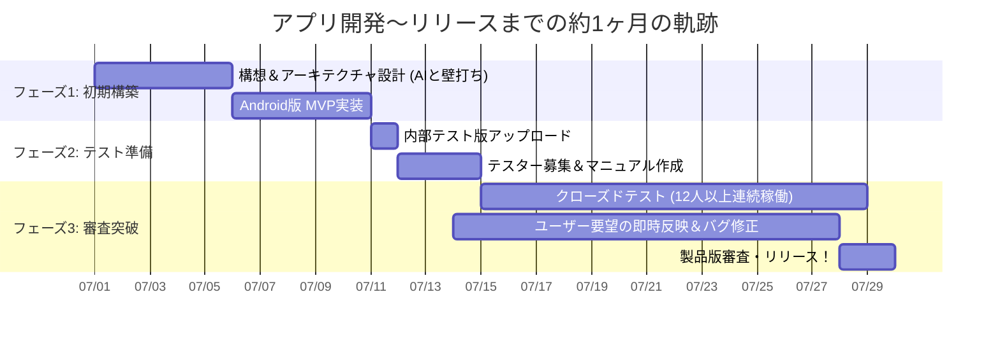
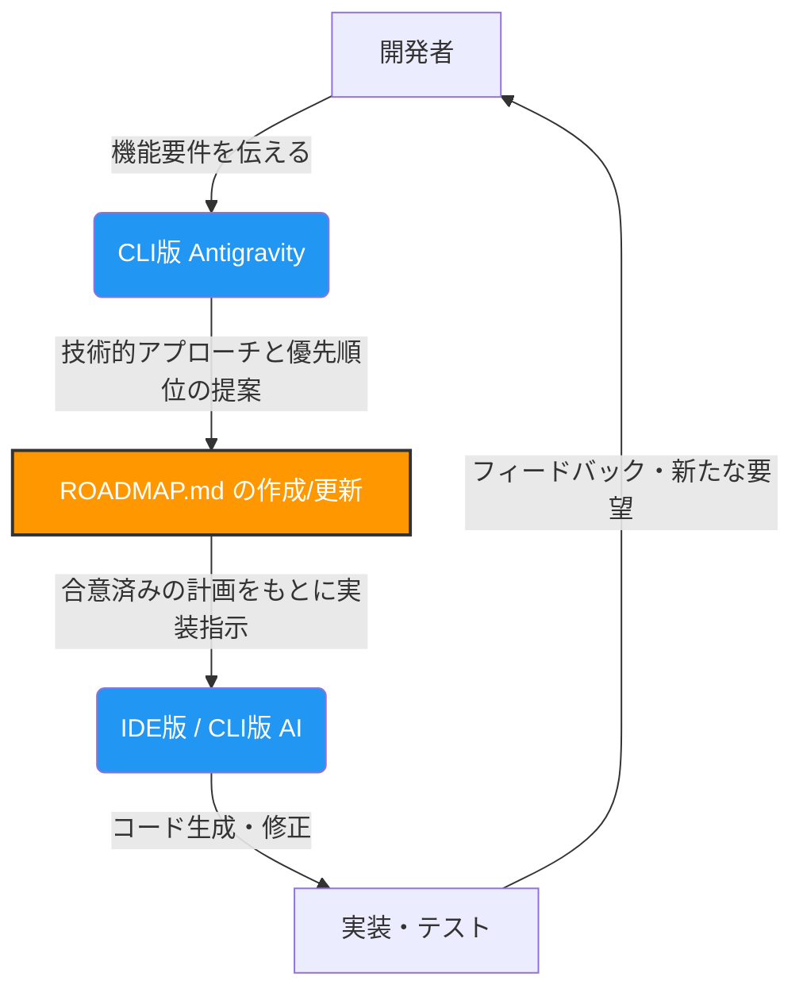

# Antigravity × KMPで挑む個人開発：構想から約1ヶ月でGoogle Play製品版リリースまで駆け抜けた話

個人開発でブラジリアン柔術のスコアボードアプリ「[JiuJitsuScoreBoard KMP](https://github.com/kusakabe-dev/JiuJitsuScoreBoard_KMP)」を開発し、構想開始から約1ヶ月というスピードでGoogle Playでの製品版リリースまで漕ぎ着けました。

本業と並行しながらの限られた時間の中で、いかにしてこのスピード感を実現したのか。その鍵となったのは、**Kotlin Multiplatform (KMP)** による徹底的な共通化と、**AIコーディングエージェント（Antigravity / Gemini）** を活用した「壁打ち駆動開発」でした。

この記事では、AIを活用したモダンなKMPアプリ開発のリアルな軌跡、直面した課題、そして突破口となったプロンプトの工夫についてまとめます。

---

## 1. 開発期間と技術スタック

* **期間:** 7月上旬から構想・開発を開始。約2週間で内部テスト版をアップロード。その後クローズドテスト（14日間）を経て、トータル約1ヶ月で製品版リリース。

* **主要技術:**
    * **Kotlin Multiplatform (KMP):** ロジックからUIまで共通化
    * **Compose Multiplatform:** UIフレームワーク
    * **アーキテクチャ:** MVVM + UDF（単方向データフロー）
* **今後の方針:** Firebase（現状はAndroid SDKのみ、将来KMP化）、RoomによるローカルDB連携を計画中

### なぜ KMP を選んだのか？
第一の理由は、シンプルに**「自分がKotlinで書くのが好きだから」**です。クロスプラットフォーム技術は他にも多数ありますが、使い慣れた大好きな言語で書けることは、個人開発のモチベーション維持において非常に重要でした。

それに加えて大きな決め手となったのが、「ロジックとUIの完全共通化」です。柔術の複雑なルールロジックやタイマー処理だけでなく、UIコンポーネントそのものも Compose Multiplatform で共通化できる点は、個人開発の生産性に非常にマッチしていました。まずは得意なAndroidで最速でMVP（Minimum Viable Product）を作りつつ、将来的にiOSアプリとしても展開できる強固な土台を持たせることができました。

---

## 2. AI（Antigravity）と二人三脚で進めたアーキテクチャ構築

今回の開発で一番の「感動ポイント」は、**AIによるアーキテクチャ構築の精度の高さ**でした。
開発初期からクローズドテスト期間の初期にかけては、主にクライアント版のAntigravityと壁打ちをしながらコードベースを作り上げていきました。その結果、「Google公式のアーキテクチャガイドライン」と「クリーンアーキテクチャ（軽量版）」を組み合わせたMVVM + UDFの構造を、AIとの対話を通じて非常に綺麗に設計することができました。

しかし、開発が進み機能追加が複雑化してくると、手戻りを防ぐための工夫が必要になってきました。

### 💡 工夫①: CLI版を用いた「ロードマップ駆動」のループエンジニアリング
クローズドテストの中盤以降、いきなりAIにコードを書かせることのリスクを感じ始めた私は、**CLI版のAntigravity** を用いてループエンジニアリングの仕組みを導入しました。
具体的には、**「いきなりコードを書かせず、まずは実装の優先順位とKMP特有の技術的アプローチ、懸念事項をMarkdownで整理して提案して」**と指示し、事前に `ROADMAP.md` を作成させる運用へとシフトしました。これにより、手戻りのない安全な設計が可能になりました。

### 💡 工夫②: 絶対ルールを刷り込む「ドメイン知識の注入」
AIは一般的なコードは書けますが、特定のスポーツのドメイン知識は持っていません。
そこで開発初期から、**大会の公式ルールブックをそのままAIに読み込ませ、複雑な採点体系をドメインロジックへと落とし込ませる**アプローチをとりました。さらに、「柔術のポイントはアドバンテージ（黄）とペナルティ（赤）がある」「勝手に自動判定しない」といったアプリ特有の思想をMarkdown（`.cursorrules` や `AI_SKILLS.md`）にまとめ、新セッションのAIに毎回読ませる仕組みを作りました。これにより、AIが仕様を無視した的外れなコードを提案してくる事故が激減しました。

---

## 3. UI/UXにおける「AI頼み」の限界と泥臭い決断

AIはロジックの構築には強いですが、**「人間が実際に使う際のUX」や「細かいUIの崩れ」**に関しては、まだまだ人間の判断と泥臭い調整が必要でした。

### 自動判定の廃止と「手動ジャッジ」への移行
当初はアプリ側でタイマー終了時に自動で勝敗判定させようとしていました。しかし、Geminiとドメイン知識を整理する中で、「柔術はレフェリーの裁量が絶対であり、タイムアップ時の状態だけで勝敗は決まらない」という結論に至りました。結果として、アプリが勝手に判定する処理を全削除し、「試合終了後に得点係が手動で勝者を選ぶフロー」に大刷新しました。

### ボタンUIから「ジェスチャーUI」への大刷新
実際の道場での利用シーンを想像すると、得点係は「試合から目を離さずに操作できること」が最優先です。そのため、小さなボタンをチマチマ押すUIを廃止。画面のスコアエリア自体を「タップで加点、長押しで減点」する仕様（Phase 5）へと変更しました。スマホに最適化したUI設計は、AIとの対話だけでなく、実際の利用シーンの想像力が試される部分でした。

*(※通信を使ったモニター外部出力機能なども試行錯誤しましたが、複雑化を避けるために今回はピボット（見送り）する決断もしました)*

---

## 4. Google Play「12人以上・14日間連続」審査の突破戦略

個人開発者にとって大きな壁となるのが、Google Playの「12人以上のテスターで14日間連続のクローズドテスト」という要件です。
今回は「柔術未経験の開発者コミュニティ」の方々にテスターをお願いしたため、ルールの前提を揃えるために急遽 **GitHub Pagesでユーザーマニュアルを作成** しました。

さらに、テスト期間中に出た要望（選手名の編集機能など）を即座に実装し、審査時の回答フォームで「ユーザー視点で改善サイクルを回した実績」として強くアピールする戦略を取り、無事に一発で審査を通過することができました。

---

## おわりに

本業をこなしながらの約1ヶ月という短期間でリリースまで到達できたのは、間違いなく **「KMPによる共通化」と「Antigravityによるコーディング支援」** の恩恵です。

AIは「万能の魔法」ではありません。しかし、プロジェクトの絶対ルール（ドメイン知識）を教え込み、ロードマップを先に書かせるという「手綱の握り方」さえ覚えれば、個人開発のスピードを何倍にも引き上げてくれる最強の相棒になります。

この記事が、これからKMPやAIを使ったアプリ開発に挑戦する方の参考になれば幸いです！

---

## 参考資料（1次情報）
- **Kotlin Multiplatform**: [JetBrains 公式ドキュメント](https://kotlinlang.org/docs/multiplatform.html)
- **Google Play クローズドテスト要件**: [個人開発者向けのテスト要件（Google Play Console ヘルプ）](https://support.google.com/googleplay/android-developer/answer/9859348)
- **JiuJitsuScoreBoard KMP**: [GitHub リポジトリ](https://github.com/kusakabe-dev/JiuJitsuScoreBoard_KMP)
- **IBJJF 公式ルールブック**: ドメインロジックのベースとなったルール（※参考: [IBJJF Rules](https://ibjjf.com/books-videos)）

## 補足：本記事の執筆背景とAIプロンプト
本記事自体も、開発時の「壁打ちログサマリー」をもとにAntigravity（Gemini）と対話しながら執筆しました。

**▼ 開発で実際に使用したロードマップ作成プロンプトの例**
> 機能追加を行う前に、いきなりコードを書かず、まずは実装の優先順位とKMP特有の技術的アプローチ、懸念事項をMarkdownで整理して `ROADMAP.md` として提案してください。

**▼ ドメイン知識注入のアプローチ**
> 初期から公式ルールブックを読み込ませたほか、`.cursorrules` や `AI_SKILLS.md` を活用し、「勝敗の自動判定はしない」「ポイントの他にアドバンテージとペナルティがある」といったドメインルールを常にコンテキストとして持たせる運用を行いました。
