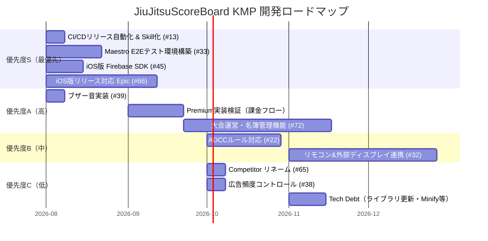

# JiuJitsuScoreBoard KMP 開発ロードマップ（2026年8月策定）

Kotlin Multiplatform（KMP）× AI駆動開発で構築中の柔術スコアボードアプリ「JiuJitsuScoreBoard KMP」の、現在時点（2026年8月）における開発ロードマップを整理しました。

これまで積み上げたIssueを優先度に基づいて分類し、今後の開発の道筋を可視化します。

---

## 現在地（2026年8月時点）

v1.2.1まで以下の機能を実装済みです：

- **IBJJFルール対応** スコアボード
- **SJJIFルール対応**（サドンデスタイマー含む）
- 選手名カスタマイズ
- タイマー設定ダイアログ（WheelPicker式UIにリプレイス）
- Firebase Analytics / Crashlytics（Android）
- AdMob広告（バナー・インターステシャル）

---

## ロードマップ

---

## 優先度別 Issue一覧

### 🚨 優先度 S（最優先）

| # | Issue |
| :--- | :--- |
| [#66](https://github.com/kusakabe-dev/JiuJitsuScoreBoard_KMP/issues/66) | [Epic] iOS版リリースに向けたタスク一覧 |
| [#45](https://github.com/kusakabe-dev/JiuJitsuScoreBoard_KMP/issues/45) | [Feature] iOS版 Firebase SDKの実装とCocoaPods連携 |
| [#33](https://github.com/kusakabe-dev/JiuJitsuScoreBoard_KMP/issues/33) | [Spike] Maestroを用いたE2Eテスト環境の構築と検証 |
| [#13](https://github.com/kusakabe-dev/JiuJitsuScoreBoard_KMP/issues/13) | リリース自動化 (GitHub Actions) とエージェントSkill化 ⚡クイックウィン |

### ✅ 優先度 A（高）

| # | Issue |
| :--- | :--- |
| [#39](https://github.com/kusakabe-dev/JiuJitsuScoreBoard_KMP/issues/39) | [Feature] カウントダウンタイマー完了時にブザー音を鳴らす ⚡クイックウィン |
| [#72](https://github.com/kusakabe-dev/JiuJitsuScoreBoard_KMP/issues/72) | [Premium] 大会運営・進行支援機能（名簿・ブラケット管理） |

### 🔵 優先度 B（中）

| # | Issue |
| :--- | :--- |
| [#32](https://github.com/kusakabe-dev/JiuJitsuScoreBoard_KMP/issues/32) | [Premium] リモコン＆外部ディスプレイ連携機能 |
| [#22](https://github.com/kusakabe-dev/JiuJitsuScoreBoard_KMP/issues/22) | [Feature] ADCCルール対応 |

### ⬜ 優先度 C（低）

| # | Issue |
| :--- | :--- |
| [#65](https://github.com/kusakabe-dev/JiuJitsuScoreBoard_KMP/issues/65) | Player → Competitor リネーム |
| [#38](https://github.com/kusakabe-dev/JiuJitsuScoreBoard_KMP/issues/38) | インタースティシャル広告の表示頻度コントロール |
| [#11](https://github.com/kusakabe-dev/JiuJitsuScoreBoard_KMP/issues/11) | ライブラリ・SDKのバージョン定期アップデート |
| [#9](https://github.com/kusakabe-dev/JiuJitsuScoreBoard_KMP/issues/9) | リリースビルドの最適化（Minifyの有効化） |

---

⚡ **クイックウィン** = 既存コードベースへの影響が小さく、短期間（〜2時間程度）で実装可能と評価されたタスク。
