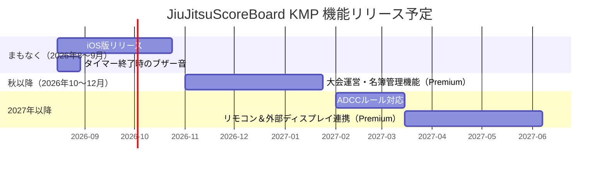

# JiuJitsuScoreBoard KMP 今後の開発予定（2026年8月時点）

柔術スコアボードアプリ「JiuJitsuScoreBoard KMP」の今後の開発予定をまとめました。

本業と並行しての個人開発のため、スケジュールは目安となりますが、優先的に取り組む順番についてはしっかりと整理しています。

---

## 開発予定（ユーザー向け機能）

---

## 各機能の概要

### 🍎 iOS版リリース
現在Android版（Google Play）のみ配信中ですが、Kotlin Multiplatform（KMP）で開発しているためiOS版も同一コードベースで対応が可能です。Firebase SDKの対応などを整えたうえで、App Storeへの申請を進めます。

### 🔔 タイマー終了時のブザー音
タイムアップ時に音が鳴るようにします。現在は視覚的な表示のみのため、見ていなくても気づける改善です。

### 🥊 ADCCルール対応
IBJJFルール・SJJIFルールに続き、ADCCルールにも対応します。サブオンリー形式やポイント体系など、ADCCルール固有のロジックを追加します。

### 📋 大会運営・名簿管理機能（Premium）
大会やスパーリング会の運営者向けに、事前に選手名簿やトーナメント表を登録しておける機能を追加予定です。課金機能（iOS/Android共通）の導入を前提として開発に入ります。

### 📡 リモコン＆外部ディスプレイ連携（Premium）
手元のスマートフォンを「リモコン」として使い、別のタブレットに「表示専用スコアボード」をリアルタイム反映させる機能です。会場での大会運営をぐっとスマートにします。

---

ご意見・ご要望などは [GitHub Issues](https://github.com/kusakabe-dev/JiuJitsuScoreBoard_KMP/issues) や、アプリ内のフィードバックフォームよりお寄せいただけると大変助かります！

引き続き、JiuJitsuScoreBoard KMP をよろしくお願いします 🤙
