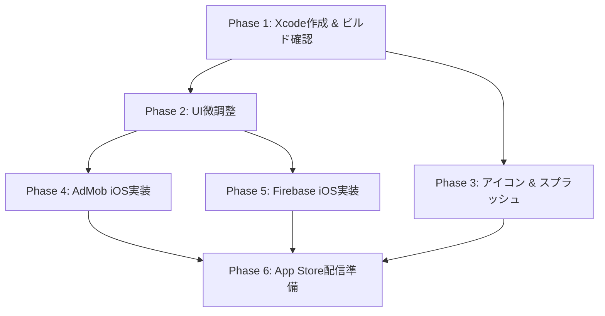

# [Epic] Issue #66: iOS版リリースに向けたタスク細分化計画

## 現状分析

プロジェクトの調査結果をもとに、iOS版リリースまでに必要なタスクの現状を整理しました。

| 項目 | 準備状況 | 備考 |
| :--- | :--- | :--- |
| UI・ビジネスロジック (`commonMain`) | 🟢 完了 | 全画面・コンポーネント・ViewModel が共通化済み |
| iOS プラットフォームブリッジ (`iosMain`) | 🟡 70% | Audio / BrowserHelper / BackHandler は実装済み。広告はスタブ |
| Xcode プロジェクト (`iosApp`) | 🔴 未着手 | ディレクトリ自体が存在しない |
| AdMob iOS実装 | 🔴 未着手 | `AdBanner` / `InterstitialAdManager` がスタブのまま |
| Firebase iOS実装 (Issue #45) | 🔴 未着手 | `GoogleService-Info.plist` 未配置、SDKバインディングなし |
| App Store 配信準備 | 🔴 未着手 | Apple Developer 登録・証明書・メタデータ等 |

---

## タスク一覧（担当者別）

### 凡例
- 🤖 **エージェント実施可能** — コード生成・設定ファイル作成などエージェントが自律的に実施可能
- 👤 **ユーザー（人間）実施必須** — Apple Developer Console操作・実機確認・アカウント系など人間でしか実施できない作業
- 🤝 **共同作業** — エージェントが雛形を作り、ユーザーが検証・仕上げを行うもの

---

### Phase 1: Xcodeプロジェクトの作成とビルド確認

| # | タスク | 担当 | 詳細 |
| :--- | :--- | :--- | :--- |
| 1-1 | `iosApp/` Xcodeプロジェクトの新規作成 | 🤖 | KMPの `ComposeApp` フレームワークを呼び出すSwift側のエントリポイント（`ContentView.swift` / `AppDelegate.swift`）を生成。`Info.plist` の雛形も作成 |
| 1-2 | Gradle iOS ビルドタスクの動作確認 | 🤖 | `./gradlew :composeApp:linkDebugFrameworkIosSimulatorArm64` 等のビルドが通ることを確認 |
| 1-3 | iOSシミュレータでの基本動作確認 | 👤 | Xcode上からシミュレータに実機ビルド＆動作確認（画面遷移、タイマー動作等） |
| 1-4 | iOS実機での基本動作確認 | 👤 | 実デバイス上でのビルド・動作確認（Provisioning Profile必要） |

---

### Phase 2: iOS向けUI微調整

| # | タスク | 担当 | 詳細 |
| :--- | :--- | :--- | :--- |
| 2-1 | セーフエリア対応の確認・修正 | 🤝 | エージェントがコード上の `WindowInsets` / `safeArea` 設定を確認・修正。ユーザーがシミュレータ/実機で見た目を検証 |
| 2-2 | 横画面固定の設定 | 🤖 | `Info.plist` で `UISupportedInterfaceOrientations` を横画面のみに設定（Android側は `AndroidManifest.xml` で設定済み） |
| 2-3 | スワイプバック等のジェスチャー競合確認 | 👤 | iOS標準のエッジスワイプジェスチャーとアプリ内操作の競合を実機確認 |

---

### Phase 3: アプリアイコン・スプラッシュ画面

| # | タスク | 担当 | 詳細 |
| :--- | :--- | :--- | :--- |
| 3-1 | iOS用アプリアイコンの `Assets.xcassets` 設定 | 🤖 | 既存Android版アイコン素材から各サイズ（1024x1024等）の `AppIcon.appiconset` を生成・配置 |
| 3-2 | Launch Screen（スプラッシュ画面）の設定 | 🤖 | `LaunchScreen.storyboard` または SwiftUIベースの Launch Screen を作成 |
| 3-3 | アイコン・スプラッシュの見た目確認 | 👤 | シミュレータ/実機で表示を確認 |

---

### Phase 4: AdMob iOS実装

| # | タスク | 担当 | 詳細 |
| :--- | :--- | :--- | :--- |
| 4-1 | Google Mobile Ads SDK (iOS) の導入 | 🤖 | CocoaPods / SPM で `Google-Mobile-Ads-SDK` を追加。`build.gradle.kts` にCocoapods plugin追加（必要な場合） |
| 4-2 | `AdBanner.ios.kt` の実装（スタブ→実装） | 🤖 | `UIViewControllerRepresentable` 等を使い、iOS版 `GADBannerView` を Compose に組み込む |
| 4-3 | `InterstitialAdManager.ios.kt` の実装 | 🤖 | iOS版 `GADInterstitialAd` のロードと表示ロジックを実装 |
| 4-4 | `Info.plist` への AdMob 設定追加 | 🤖 | `GADApplicationIdentifier`、`SKAdNetworkItems` を `Info.plist` に追加 |
| 4-5 | App Tracking Transparency (ATT) 対応 | 🤖 | `NSUserTrackingUsageDescription` を `Info.plist` に追加し、ATTダイアログ表示ロジックを実装 |
| 4-6 | AdMob管理画面でのiOSアプリ登録 | 👤 | AdMobコンソールでiOSアプリを登録し、本番用のアプリID・広告ユニットIDを取得 |
| 4-7 | 広告表示の動作確認 | 👤 | テスト広告→本番広告の表示をシミュレータ/実機で確認 |

---

### Phase 5: Firebase iOS実装 (Issue #45)

| # | タスク | 担当 | 詳細 |
| :--- | :--- | :--- | :--- |
| 5-1 | Firebase iOSプロジェクトの作成 | 👤 | Firebase Consoleで新規iOSアプリを追加し、`GoogleService-Info.plist` をダウンロード |
| 5-2 | `GoogleService-Info.plist` の配置 | 🤝 | ユーザーがダウンロードしたファイルをエージェントがXcodeプロジェクトに組み込み |
| 5-3 | Firebase iOS SDK のCocoaPods/SPM導入 | 🤖 | `FirebaseAnalytics` / `FirebaseCrashlytics` をiOSビルドの依存関係に追加 |
| 5-4 | Crashlytics / Analytics の初期化コード追加 | 🤖 | `AppDelegate` 内で `FirebaseApp.configure()` を呼び出すSwiftコードを追加 |
| 5-5 | Crashlytics 動作確認 | 👤 | テストクラッシュを発生させ、Firebase Consoleでレポートが届くことを確認 |

---

### Phase 6: App Store 配信準備

| # | タスク | 担当 | 詳細 |
| :--- | :--- | :--- | :--- |
| 6-1 | Apple Developer Program への登録 | 👤 | 年間$99の開発者プログラムへの登録（未登録の場合） |
| 6-2 | Bundle ID の作成 | 👤 | Apple Developer Portal で `net.kusakabetech.jiujitsuscoreboard` の Bundle ID を登録 |
| 6-3 | 証明書・Provisioning Profile の作成 | 👤 | Development / Distribution 証明書、Provisioning Profile の作成とXcodeへのインストール |
| 6-4 | App Store Connect でのアプリ作成 | 👤 | アプリ名・Bundle ID・SKU等の基本情報登録 |
| 6-5 | ストアメタデータの準備 | 🤝 | エージェントが紹介文・キーワードの原案を作成。ユーザーが最終確認・翻訳調整 |
| 6-6 | スクリーンショットの準備 | 👤 | 各デバイスサイズ（6.7", 6.1", 5.5"等）のスクリーンショットをシミュレータで撮影 |
| 6-7 | プライバシーポリシーの更新 | 🤖 | 既存のプライバシーポリシー（GitHub Pages）にiOS版の記載を追加 |
| 6-8 | Archive ビルド・TestFlight 配信 | 👤 | XcodeでArchive→App Store Connect にアップロード→TestFlight でテスター配信 |
| 6-9 | App Store 審査提出 | 👤 | TestFlightでの検証後、App Review に提出 |

---

## タスクサマリー（担当別集計）

| 担当 | タスク数 | 主な内容 |
| :--- | :--- | :--- |
| 🤖 エージェント | **12件** | Xcodeプロジェクト作成、Info.plist設定、AdMob/Firebase SDKのKotlin/Swift実装、アイコン生成、プライバシーポリシー更新 |
| 👤 ユーザー | **13件** | Apple Developer登録、証明書管理、Firebase/AdMobコンソール操作、シミュレータ/実機確認、スクリーンショット撮影、ストア審査 |
| 🤝 共同作業 | **3件** | セーフエリア調整、GoogleService-Info.plist配置、ストアメタデータ作成 |

---

## 推奨進行順序

> [!IMPORTANT]
> **Phase 1 が全体のゲートウェイ**です。Xcodeプロジェクトが存在しない現状では、Phase 2以降の全ての作業がブロックされます。
> まず Phase 1 を完了させ、シミュレータ上で `App()` が表示されることを確認するのが最優先です。

> [!NOTE]
> Phase 2〜5 は並行作業が可能です。エージェントがコード実装を進めながら、ユーザーはApple Developer登録やFirebase Console設定を並行して進められます。

## 確認済みの前提条件 (ユーザー回答反映)

1. **Apple Developer Program & 実機調達**: 8月15日以降に登録、およびiPhone 12（中古）を調達予定。
   - *対応方針*: 実機とアカウントが必要になる **Phase 6** と **Phase 1-4（実機確認）** は8月15日以降に行うこととし、それまではシミュレータ環境で進められる Phase 1〜5 の実装・確認を先行します。
2. **AdMob アカウント**: Android版と同じアカウントを利用する。
3. **パッケージ管理 (CocoaPods vs SPM)**: 実績の豊富さを考慮し **CocoaPods** を採用する。
4. **TestFlight テスター**: 未定（必要に応じて Phase 6 進行中に検討）。
5. **iOS版リリースの目標時期**: 8月15日以降の実機調達・アカウント登録を踏まえ、そこから段階的に検証を進める（現時点で厳密な期日は設定せず、Epic消化を優先する）。
