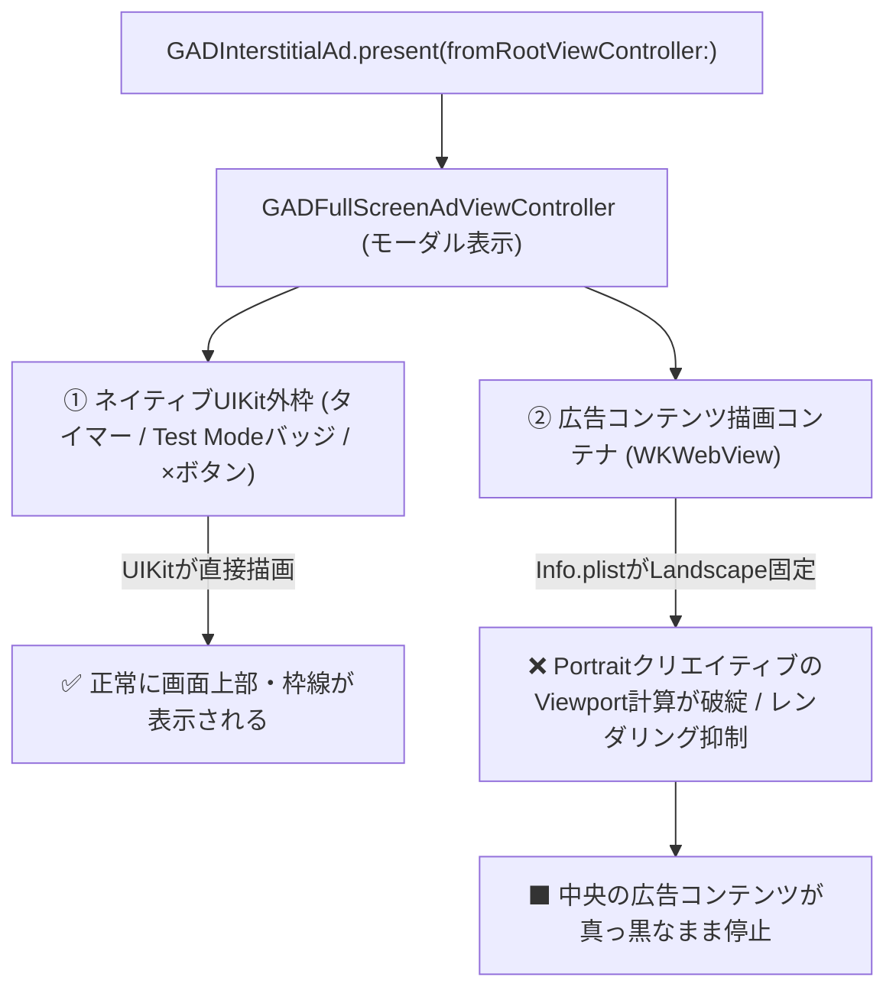

# iOS横画面固定アプリでAdMobインタースティシャル広告が黒画面になる原因と対策

## 1. 概要・要約（TL;DR）

横画面（Landscape）固定で開発しているiOSアプリ（Kotlin Multiplatform / UIKit環境）において、Google AdMobのインタースティシャル広告（`GADInterstitialAd`）を表示した際、**「上部のタイマーやTest Modeバッジ、右上の閉じるボタン等の外枠は表示されるが、中央の広告本体が真っ黒（ブランク）になる」**という不具合に遭遇した。

### 結論と原因
- **原因**: `Info.plist` の `UISupportedInterfaceOrientations` に Landscape のみ（`UIInterfaceOrientationLandscapeLeft` / `Right`）を指定していると、AdMob SDK 内部でモーダル表示される `GADFullScreenAdViewController` および広告描画用 `WKWebView` が、Portrait基準のクリエイティブ（Google公式テスト広告等）の Viewport・レイアウト計算を行えず、WebKitのレンダリングが抑制・停止してしまうため。
- **対策**: `Info.plist` の `UISupportedInterfaceOrientations` は「アプリ全体で許可しうる画面向きの最大集合（スーパーセット）」として定義し、**`Portrait` も許可リストに含める**。その上で、アプリ側の各画面（RootViewController や WindowScene）で Landscape 固定の制御を行う。

---

## 2. 発生環境

- **プラットフォーム**: iOS 16.0+ (Swift / UIKit)
- **フレームワーク**: Kotlin Multiplatform (KMP) / Compose Multiplatform
- **広告SDK**: Google Mobile Ads SDK (iOS)
- **広告形式**: インタースティシャル広告 (`GADInterstitialAd`)
- **テスト広告ユニットID**: `ca-app-pub-3940256099942544/4411468910`

---

## 3. 技術的メカニズム（なぜ外枠だけ出て中身が真っ黒になるのか）

AdMob のインタースティシャル広告が表示される内部構造と、レンダリング失敗の流れは以下の通り。



### ① 外枠（UIKit）と中身（WebKit）の描画分離
- 広告画面の外枠（上部のプログレスバー/タイマースライダー、「Test mode」バッジ、右上の閉じるボタン）は、**UIKit のネイティブコンポーネント** として実装されている。そのため、アプリが Landscape 固定であっても、UIKit の AutoLayout により画面上部に正常に描画される。
- 一方、中央の広告本体（イラスト、アニメーション、テキスト等）は、**`WKWebView` を介して動的に HTML5/CSS/メディアをロード・レンダリング** している。

### ② Info.plist による WebKit レンダリングの阻害
- Google AdMob のテスト広告をはじめとする多くのインタースティシャル広告クリエイティブは、**縦画面比率（Portrait）** を基準として構成されている。
- `Info.plist` の `UISupportedInterfaceOrientations` に `UIInterfaceOrientationPortrait` が含まれていない場合、システム（UIKit）は Portrait 向きのビュー構築・座標系計算を許可しない。
- その結果、`WKWebView` の CSS Viewport や内部レイアウト計算が破綻し、WebKit のレンダリングレイヤーが描画を完了できずに黒画面（ブランク）のまま停止する。

### ③ Android 版との挙動の違い
- Android 版の AdMob SDK（`AdActivity`）は、端末の画面向きとクリエイティブの向きが一致しない場合でも、OS/SDK レベルで自動的にレターボックス（背景余白＋アスペクト比を維持した縮小表示）を適用してレンダリングする強力なフォールバック機能を持っている。
- そのため、Android では横画面固定アプリであってもテスト広告が正常に中央表示されていたが、iOS では UIKit / WebKit の厳格な向き制約により黒画面化していた。

### ④ クロスプラットフォーム（Unity / Flutter）での同種事例
- Unity や Flutter などの横画面固定ゲーム・アプリでも同様の事例が多数報告されている。
- いずれも「`Info.plist` で Landscape のみにしておくと AdMob インタースティシャル広告の動画やクリエイティブが黒画面になる」というものであり、**「`Info.plist` では Portrait を許可し、アプリ層で画面回転をロックする」** アプローチが標準的な解決策として定着している。

---

## 4. 解決策と実装方針

### ① Info.plist の設定
`Info.plist` に `UIInterfaceOrientationPortrait` を追加し、アプリが取りうる向きの最大集合を定義する。

```xml
<key>UISupportedInterfaceOrientations</key>
<array>
    <string>UIInterfaceOrientationLandscapeLeft</string>
    <string>UIInterfaceOrientationLandscapeRight</string>
    <string>UIInterfaceOrientationPortrait</string>
</array>
```

### ② アプリ側の ViewController / WindowScene での制御
アプリ本体の画面が勝手に縦向きに回転してしまわないよう、RootViewController や WindowScene 側で Landscape 固定を指定する。

```swift
// RootViewController 側の制御例
class MainViewController: UIViewController {
    override var supportedInterfaceOrientations: UIInterfaceOrientationMask {
        return .landscape
    }
    
    override var shouldAutorotate: Bool {
        return true
    }
}
```

これにより、アプリの通常画面は横画面固定のまま維持されつつ、AdMob SDK が表示する `GADFullScreenAdViewController` は必要な向きでビューを初期化・レンダリングできるようになる。

---

## 5. 一次情報・公式リファレンス

1. **Google Mobile Ads SDK 公式ドキュメント**
   - [Google AdMob: Interstitial Ads (iOS)](https://developers.google.com/admob/ios/interstitial)
     - `GADInterstitialAd` のライフサイクル、および最前面の `UIViewController` からの `present(fromRootViewController:)` によるモーダル表示仕様。
   - [Google AdMob: Test Ads (iOS)](https://developers.google.com/admob/ios/test-ads)
     - 公式テスト広告ユニットID（`ca-app-pub-3940256099942544/4411468910`）の仕様。テスト広告のクリエイティブは Portrait 基準の HTML5 / メディアテンプレートで構成されている。

2. **Google Mobile Ads SDK Developer Group（公式技術フォーラム）**
   - Google Group: `google-admob-ads-sdk`
   - スレッド例: *"AdMob Interstitial showing black screen on Landscape mode iOS"* / *"Orientation mismatch with Interstitial ads on iOS"*
   - Google SDKサポートチームの見解:
     > 「アプリが `Info.plist` の `UISupportedInterfaceOrientations` で Landscape のみを指定している場合、SDK内部で生成されるフルスクリーン用 ViewController（`GADFullScreenAdViewController`）は、配信された Portrait 前提のクリエイティブを適切にレイアウト・レンダリングできず、外枠の閉じるボタンやプログレスバーだけが表示されて中身の WebContent 領域が黒/ブランク画面になる場合がある。これを解消するには、`Info.plist` で Portrait を許可した上で、アプリ側の各画面（ViewController / WindowScene）側で Landscape 固定の制御を行うことが推奨される。」

3. **Apple Developer Documentation（UIKit の画面向き仕様）**
   - [Apple: UISupportedInterfaceOrientations (Info.plist)](https://developer.apple.com/documentation/bundleresources/information_property_list/uisupportedinterfaceorientations)
     - `Info.plist` の `UISupportedInterfaceOrientations` は、「アプリ内で表示されうるすべての ViewController が取りうる向きの最大集合（スーパーセット）」を定義する。
     - サードパーティSDKがモーダル表示する内部 ViewController もこの制約を受ける。

---

## 6. 未解決事項・今後の課題

- **本番クリエイティブでの挙動検証**:
  - テスト広告は Portrait 基準のテンプレートだったが、本番配信時に横向き専用のクリエイティブが配信された場合のレイアウトや、動画リワード広告での挙動についても実機で継続検証が必要。
- **iOS 16+ の画面回転API対応**:
  - iOS 16 以降では `setNeedsUpdateOfSupportedInterfaceOrientations()` や `UIWindowSceneGeometryPreferencesIOS` など画面向き制御の推奨APIが刷新されているため、Swift / KMP 側のライフサイクル連携を意識した堅牢な実装を維持する。

---

## 7. 補足：AIとのやり取り（調査背景）

本記事の調査・原因特定に至った AI アシスタントとのやり取りログ。

### 質問
> 調査結果と根本原因の特定に関して、一次情報・参考情報が知りたいです。

### 回答の要点
- Google Mobile Ads SDK 公式ドキュメント、Google AdMob Developer Group の公式回答、Apple Developer Documentation（UIKit）の3点を一次情報として提示。
- ネイティブUIKit（外枠）とWebKit（WKWebView/広告コンテンツ）の描画分離による「外枠だけ出て中身が真っ黒になる」技術的メカニズムを図解。
- Android 版（`AdActivity` のレターボックス対応）との差異や、Unity/Flutter 等の横画面ゲームでの共通事例を整理。
