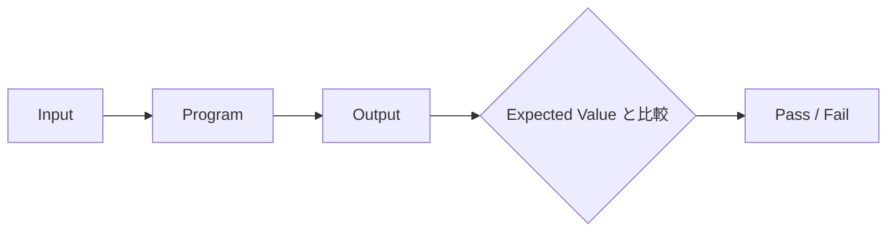

# Evals 個人学習メモ（Android/ソフトウェアエンジニア視点でのAI品質評価）

## 要約（TL;DR）

- **目的**: 初学者としてEvals（Evaluation Engineering）の基礎を理解し、「AIを使えるAndroidエンジニア」から「AIの仕事の品質を定量的に評価・統制できるSoftware Engineer」への足がかりとする個人学習メモ。
- **結論**: Evalsは別世界の概念ではなく、従来のテスト（Unit/UI/Lint/CI/QA）の延長線上にある。特にCoding Agentの評価においては、すべてをLLMに判定させるのではなく、**既存の決定論的ツール（Build, Test, Lint, Konsist, Git Diff解析）を強力なGrader（評価器）として活用するハイブリッド構成**が最も現実的かつ強力である。
- **本稿の扱い**: 本メモは固定的な完成版ではなく、イベント視聴や実践を通じて継続的に更新していく。

---

## 更新履歴（Changelog）

- **2026-10-03**: 初版作成（Evalsの基礎理解、Androidエンジニア視点での接点、Coding Agent評価のアイデア、学習ロードマップの整理）

---

## 1. このメモの位置づけ

これは、**Evals / Evaluation Engineering** について個人的に学ぶためのメモ。

業務への適用も将来的には考えたいが、まずは「自分自身がEvalsを理解すること」を目的とする。
現時点ではEvalsについて初学者であり、専門職としてのEvals Engineerを目指すと決めているわけではない。

自分はAndroidエンジニアなので、

> **「Android / Software Engineerとして、AI時代にEvalsの考え方をどう取り入れるか」**

という観点で学びたい。

---

## 2. Evalsに興味を持ったきっかけ

以下のイベントを視聴予定。

* **イベント名**: ソフトウェア品質のスペシャリスト・Evalsエンジニアと考える AIエージェント開発と評価の現在地
* **一次情報URL**: [https://forkwell.connpass.com/event/407974/](https://forkwell.connpass.com/event/407974/)

「Evalsエンジニア」という専門職の役割を見かけたものの、これまでEvalsに関する体系的な知識がほぼなかったため、基礎から理解したいと思った。

---

## 3. 現時点でのEvalsの理解

Evalsは、

> **「LLMやAI Agentの出力・行動について、感覚ではなく、一定の評価基準を使って継続的に品質を測る仕組み」**

と理解している。

### 通常のソフトウェアテストとの対比

通常のソフトウェア開発では、期待値との完全一致をテストしやすい。



一方、LLMやAI Agentでは自然言語やコード生成など「唯一の正解」が存在しないケースが多い。そのため、複数の評価手法を組み合わせて多面的に評価する。

| 評価手法 | 内容・特徴 |
| --- | --- |
| **Deterministic（確定的評価）** | コンパイル成否、単体テスト、静的解析、正規表現マッチなど。ブレがない。 |
| **Rule-based（ルールベース評価）** | スキーマ検証（JSONバリデーション）、ブラックリストワード、差分行数制限など。 |
| **LLM-as-a-Judge（モデル評価）** | 別のLLMに採点基準（ルーブリック）を与えて成否や品質を判定させる。 |
| **Human Evaluation（人手評価）** | ドメインエキスパートやエンジニア自身による最終レビュー・アノテーション。 |
| **Production Metrics（本番運用指標）** | 採用率、ユーザー満足度、エラー率、レイテンシ、コストなどの実運用メトリクス。 |

---

## 4. Androidエンジニアとの接点

Evalsは完全に別世界の概念というより、**既存のSoftware Engineeringにかなり近い**と感じている。

Android開発ではこれまで、以下のような仕組みで品質を確認してきた：

* Unit Test / Integration Test / UI Test（Robolectric, Compose Test）
* Regression Test
* CI / CD（GitHub Actions, Bitrise等）
* QA
* Firebase Crashlytics / Analytics

AI Agentの場合も、本質的な改善サイクルは酷似している。

```mermaid
flowchart TD
    Dataset[Eval Dataset (タスク・要件)] --> Agent[AI Agent]
    Agent --> Output[Output / Action (コード差分・PR)]
    Output --> Grader[Grader (Build / Test / Lint / Judge)]
    Grader --> Score[Score / 判定結果]
    Score --> Feedback{失敗ケースの分析}
    Feedback -->|プロンプト・モデル・ルールの改善| Agent
    Feedback -->|エッジケースの蓄積| Dataset
```

そのため、自分の中ではEvalsを

> **「AIをソフトウェア開発に組み込むための品質保証（QA / Testing）」**

として捉えると非常に腹落ちしやすい。

---

## 5. キャリア・スタンス：現時点ではEvals Engineerへの職種変更は考えない

今のところ、「Android EngineerからEvals Engineerへ転身する」という考え方ではない。
むしろ目指したいのは以下の掛け合わせ：

$$\text{Android Engineer} + \text{AI Engineering} + \text{Evaluation設計}$$

つまり、

* 「AIを使えるAndroidエンジニア」からさらに一歩進んで、
* **「AIの品質を評価・統制しながら使えるSoftware Engineer」**

を目指すイメージ。

---

## 6. 特に興味があるテーマ：Coding AgentのEvals

一般的なChatbotの会話評価よりも、**「Coding AgentのEvals」** に強く興味がある。

普段の開発では Claude Code、Codex、その他Coding Agentを使うことがあるが、その際に

> **「このAI、本当に良い実装をしているのか？」**

を感覚ではなく定量的に判断できるようになると面白そう。

例えばAndroid Coding Agentなら、以下のように評価を二層に分解できる。

### A. Deterministicな評価（機械的に白黒つけられるもの）

すべてをLLMに評価させる必要はなく、従来のツールをそのままGraderとして利用できる：

- [ ] `./gradlew assembleDebug`（ビルドが通るか）
- [ ] `./gradlew test`（Unit Testが通るか）
- [ ] `./gradlew lint` / Detekt（静的解析・Lintが通るか）
- [ ] Konsist（レイヤー構造や命名規則などアーキテクチャテストが通るか）
- [ ] 不要な `!!`（強制アンラップ）が増えていないか
- [ ] 大量の不要変更・触ってはいけないファイルの書き換えをしていないか

### B. Semanticな評価（意味や文脈の判定が必要なもの）

- [ ] 要件を満たしているか
- [ ] 既存の設計方針・Architectureと整合しているか
- [ ] Scope外の不要な変更や過剰実装（Over-engineering）をしていないか
- [ ] Null Safetyを悪化させていないか
- [ ] 後方互換性やAPIの不要な破壊をしていないか

---

## 7. Coding AgentのEvalを試すとしたら（SWE-bench方式のミニマム実践）

個人的な学習題材としては、**過去のAndroidタスク（Issue / PR）** を使うのが最も手堅い。

```text
過去のIssue
    ↓
Coding Agentに実装させる
    ↓
Build & Test & Lint & 差分検査（Grader）
    ↓
Human Review / LLM-as-a-Judge
    ↓
結果を記録
```

### 見る指標の例

| 指標名 | 内容 | 判定方法 |
| --- | --- | --- |
| **Task Completion Rate** | 要件を満たしてタスクを完遂できたか | テストパス ＋ レビュー |
| **Build Success Rate** | コンパイルが通るコードを出せたか | `./gradlew assemble` |
| **Test Pass Rate** | 検証用テストおよび既存テストの通過率 | `./gradlew test` |
| **Scope Drift / File Count** | 変更ファイル数や行数が過大でないか | `git diff --stat` |
| **Safety Violations** | `!!` の混入や保護ファイルの編集 | スクリプト / 正規表現 |
| **Human Edit Distance** | 人間の手直しがどれくらい必要だったか | PR後の手動修正量 |

これだけでもEvalsの考え方をかなりリアルに体験できそう。

---

## 8. モデル比較・リグレッション評価への興味

将来的には同じタスクセットを、Claude Code、Codex、Gemini系Agentなどに実行させて比較してみたい。

ただし、「どのモデルが最強か」という単一の優劣を決めたいわけではない。

* 調査・仕様把握
* Bug Fix
* 小規模な新機能実装
* Refactoring
* Testコードの追加

といったタスク種別ごとに、**「どのAgentがどういう仕事を得意とするのか」** の特性を見極めたい。

また、
- モデルのバージョン更新
- プロンプトの変更
- 参照ドキュメント（Rules / Skills）の改定
- Agentの設定変更

を行った際に、以前解けていたタスクが解けなくなっていないかを検知する **「Regression Eval（回帰評価）」** にも大いに興味がある。

---

## 9. 学習ロードマップ

* [x] **Step 1: 概念の整理・理解**
  * キーワード：Eval Dataset, Grader/Evaluator, LLM-as-a-Judge, Human Eval, Regression Eval, Agent Eval, Trace Evaluation
* [ ] **Step 2: 「良いAIの実装とは何か」の言語化・定義**
  * 何を測れば品質が良いと言えるのか？（採点基準・ルーブリックの策定）
* [ ] **Step 3: 小さなEval Datasetを作る**
  * 最初は5〜10ケース程度（過去のバグ修正やテスト追加PRから抽出）
* [ ] **Step 4: Coding Agentに実行させて結果を記録する**
  * ビルド成否、テスト通過率、Git Diffの安全性をスクリプトで自動測定
* [ ] **Step 5: LLM-as-a-Judgeを一部試してみる**
  * Booleanチェックリストで判定させ、Human Reviewとの一致率を確認
* [ ] **Step 6: AI Agentを使った開発フローそのものの評価・改善ループへ昇華**

---

## 10. Pythonに関するスタンス

Evals界隈ではPython（各種Evalフレームワークや分析）を使うことが多いため、最低限は読める・書けるようにしておきたい。

ただし現時点では「Pythonを本格的に極めること」自体が目的ではない。

```text
優先順位：
Evaluation設計 ≧ Software Testing > AI Agentの理解 > LLMの基本 > Python ≒ 統計・メトリクス > ML理論
```

特に「何を評価すべきか（テスト観点・ドメイン知識）」を設計できるソフトウェアエンジニアとしての能力の方が重要と考えている。

---

## 11. イベント視聴時に確認したいこと（チェックリスト）

以下の疑問を念頭に置いてイベントを視聴する。

- [ ] **Eval Datasetはどう作っているのか？**（本番ログから抽出？ 人工生成？ 過去のIssue？）
- [ ] **何件くらいから始めるのが現実的か？**（数ケース〜数十ケースでの運用の実際）
- [ ] **正解（Ground Truth）は誰がどう決めているのか？**
- [ ] **LLM-as-a-Judgeをどこまで信用してよいか？**（評価のブレへの対処）
- [ ] **Human Evalと自動Evalのコスト・使い分けはどうしているか？**
- [ ] **Productionでの失敗事例をどうやってEval Datasetへ還元（Flywheel化）しているか？**
- [ ] **CI/CDへどう組み込んでいるか？**（実行時間・API費用の問題）
- [ ] **Evals専任者はどのフェーズで必要になるのか？**
- [ ] **Software EngineerとEvals Engineerの境界・コラボレーションはどうあるべきか？**

---

## 12. 今後このメモに追加・アップデートしていきたいこと

- [ ] イベント視聴メモ・得られた知見のまとめ
- [ ] Evalsに関する重要用語集
- [ ] 実際に試したEvalの実行ログ・気づき
- [ ] 面白かった文献・記事・論文のリンク
- [ ] Coding Agentを評価して気づいた「AIの癖・苦手パターン」
- [ ] LLM-as-a-Judgeの失敗例とプロンプト改善例
- [ ] Android / KMP 開発へ応用できそうな具体的なGraderアイデア
- [ ] 自身のエンジニアキャリアにおける位置づけの深掘り

---

## 付録：他リポジトリへ流用可能なサンプルアセット

本学習メモから派生して作成した、他リポジトリ（Androidプロジェクト等）で即座に流用可能なサンプルツール群です。

* [samples/evals/README.md](../samples/evals/README.md): 導入手順と使い方
* [samples/evals/check_agent_diff.py](../samples/evals/check_agent_diff.py): `git diff` を解析し、不要な `!!` やスコープ逸脱、保護ファイル改変を検知するPython Grader
* [samples/evals/run_android_deterministic_eval.sh](../samples/evals/run_android_deterministic_eval.sh): Gradle Build, Test, Lint, Diff検査を一括実行するランナー
* [samples/evals/dataset/eval_dataset.yaml](../samples/evals/dataset/eval_dataset.yaml): 5ケース分のSWE-bench風タスク定義データセット
* [samples/evals/judge/llm_judge_prompt_template.md](../samples/evals/judge/llm_judge_prompt_template.md): LLM-as-a-Judge用の二値判定ルーブリックプロンプト
