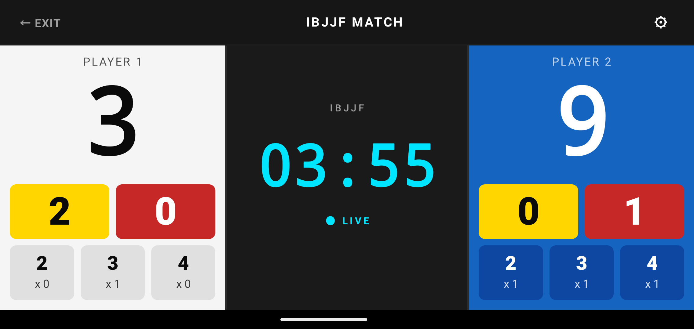

# Jiu Jitsu ScoreBoard ユーザーマニュアル

> [!WARNING]
> **ページ移転のお知らせ**
> 本マニュアルは新しいディレクトリに移行しました。
> 最新版のマニュアルは [こちら（jiujitsu-scoreboard/manual.md）](jiujitsu-scoreboard/manual.md) をご覧ください。

Jiu Jitsu ScoreBoard（柔術スコアボード）は、ブラジリアン柔術やグラップリングの練習試合、スパーリング向けに開発されたシンプルなスコアボードアプリです。

## 画面の見方と基本操作

### スコアの加算・減算

画面下部のコントローラー領域にある各ボタンを操作します。

- **タップ（短押し）**: スコアを加算します。
- **長押し（ロングタップ）**: スコアを減算（取り消し）します。

*各ボタンの役割と色*

- **下部の数字ボタン（2, 3, 4）**: ポジションやアクションに応じたポイント（テイクダウン、パスガード、マウントなど）
- **黄色の枠（数字部分）**: アドバンテージ（ADV）
- **赤色の枠（数字部分）**: ペナルティ / ルーチ（PEN）

### タイマーの操作

画面中央のタイマー領域をタップすることで、タイマーの「開始」および「一時停止」を切り替えます。

### 試合設定の変更

右上の「⚙️（歯車アイコン）」をタップすると、設定メニューが開きます。
ここでは以下の設定が可能です。

- **試合時間の変更**: 1分〜10分など、試合時間を設定できます。
- **試合のリセット**: スコアとタイマーをすべて初期状態（0:00）に戻します。

## ルールについて

初期バージョン（v0.1.0）では、IBJJF（国際ブラジリアン柔術連盟）の基本的なスコアリング方式に準拠しています。今後のアップデートにより、SJJIFやADCCなどの別ルールへの対応を予定しています。

## お問い合わせ

不具合の報告や機能のご要望などがございましたら、各ストアのレビュー、または開発者の連絡先までお気軽にお知らせください。
