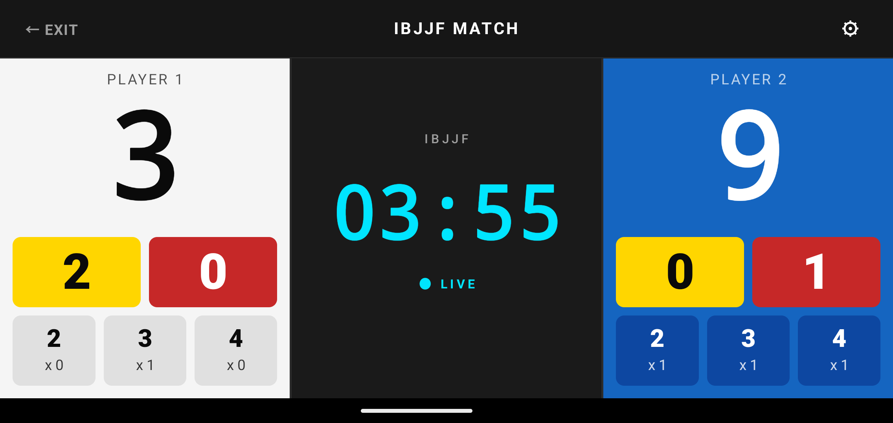
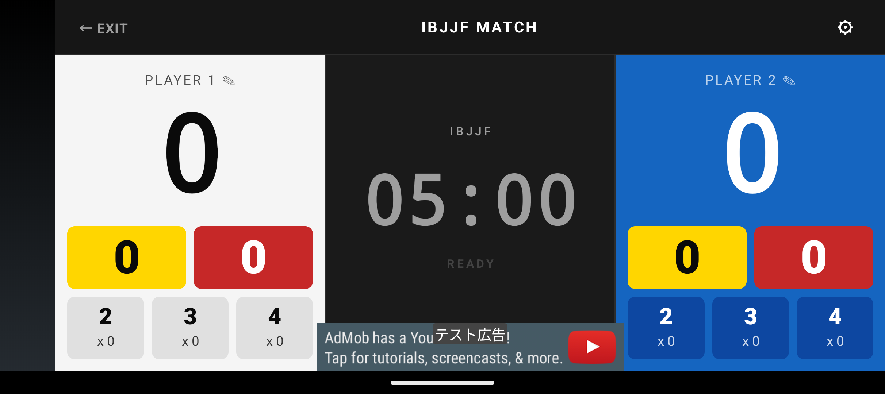
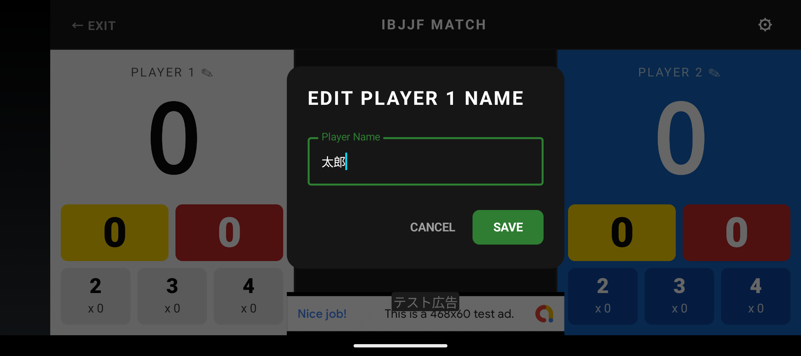
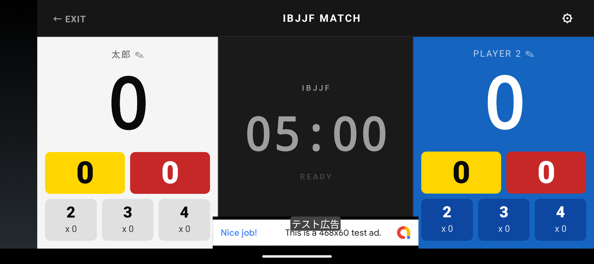

# Jiu Jitsu ScoreBoard ユーザーマニュアル (IBJJFルール)

Jiu Jitsu ScoreBoard（柔術スコアボード）は、ブラジリアン柔術やグラップリングの練習試合、スパーリング向けに開発されたシンプルなスコアボードアプリです。

## 画面の見方と基本操作

### 選手名のカスタマイズ（変更）
試合開始前またはリセット直後（タイマー停止状態）に、各選手のラベル（デフォルトは `PLAYER 1` / `PLAYER 2`）にある `✎` アイコンをタップすると、選手の名前を任意に変更・入力することができます。

  
  
  

※誤操作を防ぐため、試合中（タイマー稼働時）は名前の変更ができません。

### スコアの加算・減算
画面下部のコントローラー領域にある各ボタンを操作します。
- **タップ（短押し）**: スコアを加算します。
- **長押し（ロングタップ）**: スコアを減算（取り消し）します。

*各ボタンの役割と色*
- **下部の数字ボタン（2, 3, 4）**: ポジションやアクションに応じたポイント（テイクダウン、パスガード、マウントなど）
- **黄色の枠（数字部分）**: アドバンテージ（ADV）
- **赤色の枠（数字部分）**: ペナルティ / ルーチ（PEN）

### タイマーの操作
画面中央のタイマー領域をタップすることで、タイマーの「開始」および「一時停止」を切り替えます。
試合タイマーが残り0秒（0:00）になると、タイムアップ時に自動でブザー音が鳴動し、試合終了をお知らせします。

### 試合設定の変更
画面上部バーから各種設定や操作を行えます。
- **画面左上の `← EXIT` ボタン**: タップすると試合を終了し、ホーム画面（ルール選択画面）に戻ります。
- **画面右上の `⚙`（設定アイコン）**: タップするとドロップダウンメニューが展開されます。
  - **⏱ 試合時間設定**: 試合開始前（タイマー停止中）にタップすると、試合時間（1分〜10分等）をホイール選択で設定できます。
  - **⇄ 左右スコア入れ替え**: タイマー一時停止中にタップすると、左右選手のスコア入れ替え確認ダイアログが表示されます。

### 左右選手のスコア入れ替え（スワップ機能）
試合中に左右の選手情報（選手名、スコア、アドバンテージ、ペナルティ）をワンタップで入れ替えられる機能です。

- **用途**: 試合中の立ち位置の入れ替わり、道着の色（白/青）の左右配置の修正、または左右逆に入力してしまった場合のリカバリーに使用できます。
- **操作手順**:
  1. 試合中の場合は、画面中央のタイマーをタップして **「一時停止（PAUSE）」** します（※誤操作防止のため、タイマー稼働中はメニューが無効化されています）。
  2. 画面右上の **「⚙」アイコン** をタップし、ドロップダウンメニューから **「左右スコア入れ替え」** を選択します。
  3. 確認ダイアログが表示されるので、**「入れ替える」** をタップします。
  4. 左右の選手名、ポイント、アドバンテージ、ペナルティがすべて左右反転して入れ替わります。

### 全画面表示（イマーシブモード）
- 試合画面表示中は、画面を最大限広くスコアボードとして活用できるよう、端末のステータスバーやナビゲーションバーが自動的に非表示（全画面表示）になります。
- 画面端から内側へスワイプすることで一時的に端末のシステムバーを表示・確認できます。

## ルールについて
このページは、IBJJF（国際ブラジリアン柔術連盟）の基本的なスコアリング方式に準拠したモードについての説明です。

### IBJJFルールの特徴
- **ペナルティの累積**: ペナルティ（反則やルーチ等）が累積すると、相手にアドバンテージやポイントが付与されます。
  - 1回目: ペナルティのみ記録
  - 2回目: 相手にアドバンテージ付与
  - 3回目: 相手に2ポイント付与
  - 4回目: 累積で失格（DQ）
- **勝敗の判定優先順位**:
  1. ポイントが多い方が勝利
  2. アドバンテージが多い方が勝利
  3. ペナルティが少ない方が勝利
  4. すべて同点の場合はレフェリー判定

## お問い合わせ
不具合の報告や機能のご要望などがございましたら、以下のフォーム、各ストアのレビュー、または開発者の連絡先までお気軽にお知らせください。

- [お問い合わせフォーム](https://forms.gle/AR5hYW2MogRoePpn8)

---

## 免責事項
本アプリは細心の注意を払って開発されておりますが、動作の完全性や正確性を保証するものではありません。
本アプリを利用したことによって生じた、試合結果のトラブル、端末の不具合、その他のいかなる損害についても、開発者は一切の責任を負わないものとします。
（実際の公式試合等でご利用になる場合は、バックアップのスコアボードと併用するなど、利用者の責任においてご活用ください。）
